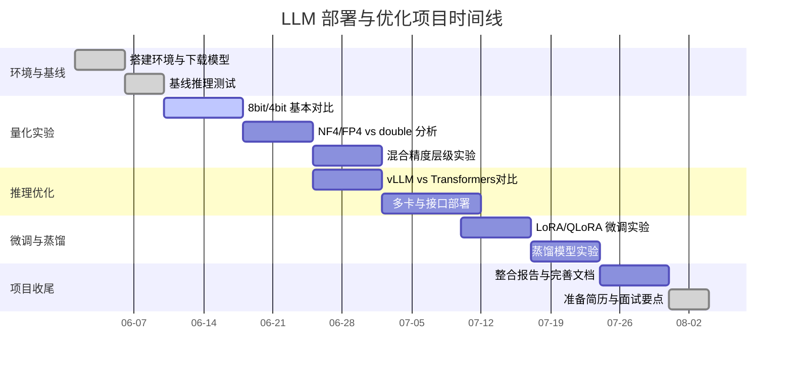

# 执行摘要
本方案针对 AI 工程岗位需求，制定了**2–6 个月**的系统学习与实战计划，涵盖模型部署、推理优化、量化、微调（LoRA/QLoRA）、蒸馏、vLLM 等核心技术。学习目标包括掌握大模型部署流程、理解量化和蒸馏原理与数学基础、熟练使用 Hugging Face、bitsandbytes、vLLM 等工具链，并完成一套可复现的项目：下载并缓存大模型，设计并运行定量实验（FP16/INT8/4bit NF4 vs FP4 vs double quant vs AWQ/GPTQ），构建高吞吐推理服务（FastAPI/vLLM），生成实验报告（显存、延迟、吞吐、精度对比）和简历项目演示。该计划结合理论、动手和开源资源，以确保你快速积累实战经验，达到“可以面试深入阐述技术细节并独立完成大模型部署与优化”的水平。

# 学习目标
- **理论掌握**：理解深度学习基础（Transformer 结构、注意力机制）和相关数学（数值表示、量化误差、二阶近似、Kullback-Leibler 等），了解知识蒸馏原理【10†L69-L72】【16†L49-L52】。  
- **量化技术**：熟悉 8 位、4 位量化原理及常用数值格式（INT8、INT4、NF4、FP4、double quant），掌握 PTQ 算法（如 GPTQ、AWQ、SmoothQuant），理解量化对模型精度和性能的影响【16†L49-L52】【17†L19-L23】。  
- **微调与蒸馏**：学习 LoRA/QLoRA 等高效微调方法，了解用大模型数据训练小模型的知识蒸馏流程。  
- **框架工具**：熟练使用 PyTorch、HuggingFace Transformers/Accelerate/PEFT，bitsandbytes（量化）、AutoGPTQ、AutoAWQ，以及 vLLM 推理引擎，实现多卡/批量化推理【8†L426-L434】【18†L226-L234】。  
- **部署服务**：掌握 FastAPI/Gradio/BentoML 等接口框架，将优化后的模型打包为可在线 API 服务。  
- **性能评估**：能够设计对照实验，测量并分析不同方案下的显存占用、延迟、吞吐率及生成质量（包括自动指标和人工评估），撰写对比报告并总结最优实践。  

# 学习先决条件
- **编程与环境**：熟悉 Python 编程，掌握 Linux 基本命令，了解 Git/GitHub。  
- **深度学习基础**：具备深度学习基础知识，了解神经网络和反向传播；会使用 PyTorch 进行简单模型训练与推理。  
- **数学基础**：掌握线性代数、概率统计基础（均值、方差、分布）、微积分（Taylor 展开、Hessian 矩阵概念）。  
- **硬件知识**：理解 GPU 基本架构（CUDA 核心、显存带宽）和并行计算概念，有 N 卡推理或分布式的初步了解。  

# 学习路线图（2–6 个月）

| 周数 | 主题与任务 | 交付成果 (产物) |
|----|:-----------|:-----------|
| **第1周** | **环境搭建 & 原始模型加载**<br>- 在 Kaggle T4 GPU 环境下载大模型（如 Llama-3-8B 或 Qwen3.5-9B）并保存为 Dataset；<br>- 测试在单 GPU 上 FP16 加载并生成示例输出（注意可能显存 OOM）；<br>- 记录显存占用和生成延迟作为基线。 | Notebook：`01_download_and_baseline.ipynb`<br>显存/延迟基线数据 |
| **第2–3周** | **量化基础实验**<br>- 使用 bitsandbytes 做 8bit 和 4bit 量化：试用 `load_in_8bit=True`、`load_in_4bit=True, bnb_4bit_quant_type="nf4"、"fp4"`、`bnb_4bit_use_double_quant` 等组合;<br>- 控制变量对比：同一 prompt、同一批大小，测量显存、初次输出延迟、生成总时长；<br>- 对比输出质量（如困惑度或示例回答质量）。| Notebook：`02_quantization_benchmark.ipynb`<br>Benchmark 表格/图表（显存 vs 速度 vs 质量） |
| **第4–5周** | **深入量化原理**<br>- 学习 NF4/FP4 来源（QLoRA 论文），理解群组量化和 double quant 的原理【8†L426-L434】【8†L446-L452】；<br>- 设计实验：对比 NF4 vs FP4、启/禁 double quant，分析效果差异；<br>- 阅读并总结 GPTQ 和 AWQ 算法原理【18†L226-L234】【19†L99-L102】，举例说明关键权重量化思想。| 文档：`03_quantization_analysis.md`<br>实验结果 CSV/图；综述报告（包含图片和公式） |
| **第6–7周** | **混合精度 & 层级敏感度**<br>- 实现部分层量化：如只量化线性层、跳过部分敏感层（embedding/LayerNorm）；<br>- 分析不同层、不同通道对性能的敏感度；<br>- 记录混合精度方案的显存和精度变化。| Notebook：`04_mixed_precision.ipynb`<br>对比表（层级 vs 影响），分析报告 |
| **第8–9周** | **vLLM 高性能推理**<br>- 安装 vLLM，使用单 GPU 运行同一模型；<br>- 对比 Transformers vs vLLM：单请求延迟和多请求吞吐；<br>- 实现 vLLM 的多卡张量并行测试（`tensor_parallel_size=2`）；<br>- 测试带量化模型的 vLLM 推理（AWQ/GPTQ 量化后加载），记录性能。| Notebook：`05_vllm_benchmark.ipynb`<br>吞吐 vs 延迟对比图（vLLM vs TF） |
| **第10–11周** | **服务化与接口**<br>- 使用 FastAPI 或 Gradio 将模型部署为在线服务；<br>- 集成负载测试：模拟多用户并发请求，评估吞吐性能；<br>- Docker 镜像打包练习（可选）；<br>- 编写项目文档，包括运行说明、API 文档。| 脚本：`app.py`（FastAPI 服务）<br>Demo 视频/截屏<br>Dockerfile (可选) |
| **第12–14周** | **微调与蒸馏实验**<br>- 对比方案：大模型(原始/量化)、微调小模型、蒸馏模型；<br>- 使用 LoRA/QLoRA 对大模型做微调，或者用大模型生成数据微调小模型；<br>- 将微调模型再做量化，观察精度 vs 资源占用变化；<br>- 记录不同方案下推理效果（定量指标+示例输出）。| Notebook：`06_distillation_lora.ipynb`<br>对比表（微调 vs 原始 vs 量化） |
| **第15–16周** | **综合复现与项目整理**<br>- 整合前述结果，完成最终报告；<br>- 创建 GitHub 目录（包含 Notebooks、脚本、数据读取、结果图表、README）；<br>- 撰写简历项目描述和面试要点；<br>- 根据需要准备 CI (GitHub Actions) 以自动化运行简单测试。| 完整项目仓库<br>README + 实验报告<br>简历&面试用要点清单 |

> **说明**：每周任务后要求提交对应的 Notebook、脚本或报告。例如第2周提交 `02_quantization_benchmark.ipynb`，包含实验代码和数据；第10周完成 API 服务脚本和演示。进度可以依情况调整，关键是每周形成可展示成果并撰写总结。

# 核心学习内容

## 模型部署与量化基础  
- **原始模型加载**：使用 HuggingFace Hub `snapshot_download` 将模型文件缓存到本地（如 Kaggle 工作目录）【4†L96-L104】；加载时注意使用 `torch_dtype=torch.float16` 或指定 `device_map` 以将模型放到 GPU。  
- **量化流程**：量化是将高精度浮点数近似为低比特数据以减少显存和计算【16†L49-L52】【10†L69-L72】。常见做法包括：只量化权重（如 INT4）保留激活为 FP16/BF16（称 W4A16，如 GPTQ/AWQ 方法），或者同时量化权重与激活（如 W8A8，在 SmoothQuant 中使用）【17†L19-L23】。注意：量化后**显存占用大减**，但反量化（dequant）可能增加计算开销，4bit 未必比 8bit 更快。  
- **bitsandbytes 工具**：学习使用 `bitsandbytes` 库的 `BitsAndBytesConfig` 进行量化：如 `load_in_4bit=True, bnb_4bit_quant_type="nf4", bnb_4bit_compute_dtype=torch.bfloat16`【8†L426-L434】。NF4（Normal Float 4）是在 QLoRA 中提出的 4bit 格式，适合正态分布的权重【8†L426-L434】；nested (double) quantization 可进一步**减少显存**（约额外节省 0.4 位/参数），不增加推理时间【8†L446-L452】。对比试验如关闭 double quant 通常会增加显存。  
- **量化关键难点**：如 【AWQ】强调“激活感知”——发现只有 ~0.1%-1% 的权重对精度贡献最大，跳过这些“关键权重”可显著降低量化误差【19†L99-L102】。GPTQ 则使用近似 Hessian（二阶信息）和逐元素校正，使得 4bit 量化后的模型精度接近全精度（接近 FP16 性能）【18†L226-L234】。学习并比较这些方法的原理，有助于理解量化后的精度差异。  

## 推理优化与 vLLM  
- **vLLM 框架**：vLLM 是 Meta 开源的高性能 LLM 推理引擎，采用分页注意力（PagedAttention）动态管理 KV Cache，解决显存碎片问题，提高多请求并发吞吐。实测中，vLLM 在单卡上批量推理时延、吞吐均优于传统 Transformers 【4†L133-L141】。需要掌握 vLLM 的使用：例如 `LLM(model="facebook/opt-125m")` 快速运行离线推理，或 `vllm.entrypoints.openai.api_server` 部署 OpenAI 兼容服务。可学习 vLLM 文档中的示例【4†L129-L137】【4†L153-L161】。  
- **并行与批处理**：了解张量并行（tensor parallel）和流水线并行，能够用 vLLM 或 HF Accelerate 将模型拆分到多卡。比如设置 `CUDA_VISIBLE_DEVICES="0,1"`、`tensor_parallel_size=2` 等。对比单卡/双卡、多请求与单请求的性能差异，了解什么场景下最适合并行。  
- **API 服务**：学习将模型打包为服务。可使用 Hugging Face’s `transformers.pipeline` 或 vLLM 的 OpenAI server 模式，再用 FastAPI/Gradio 书写接口；或者使用 Hugging Face API server 模式集成 LangChain/Gradio。目标是实现一个简单的推理接口，例如 `/generate` 接受 prompt 返回回复。  

## 蒸馏与微调  
- **知识蒸馏**：Distillation 指训练一个小模型（Student）去模拟大模型（Teacher）的输出概率分布，得到小尺寸却性能接近的大模型表现。常见方法包括 TinyLlama、DistilBERT、RLHF 等。对于 LLM，可用大模型生成的问答对对小模型进行训练。学习 Hinton 等经典“知识蒸馏”理念，但注意目前 LLM 的蒸馏工程成本较高，需要大量算力和数据。  
- **LoRA/QLoRA**：高效微调技术，如 LoRA 在少量参数上训练（低秩矩阵）以适应特定任务。QLoRA 将位宽降到 4-bit 进行微调，极大降低显存需求。掌握使用 HuggingFace PEFT 库（如 `LoraConfig`）进行 LoRA 微调，同时可以结合 bitsandbytes 进行 4bit 微调。  
- **对比实验**：项目中可以做一个较小规模的蒸馏演示：用大模型（如 Llama）生成一些问答数据，用 LoRA 微调一个 7B 模型，使其在某任务（如回答、翻译）表现提升。然后对比该小模型、原大模型以及其量化版本的输出质量和性能。  

# 实验设计与评估

- **对照实验设计**：确保每次实验只有一个变量改变。常见实验矩阵：<br> 1) **量化模式 vs 指标**：列如 FP16、INT8、NF4、FP4、AWQ/GPTQ 4bit 等，对比显存（Memory）、延迟(Latency)、吞吐(Throughput)、生成质量(Quality)。<br>2) **推理框架 vs 指标**：如 Transformers 单卡 vs vLLM 单卡 vs vLLM 双卡，对比单输入延迟与多输入吞吐。<br>3) **混合设置 vs 指标**：如不同层部分量化与否、NF4 vs FP4 vs 双量化 vs 激活量化，评估对输出精度的影响。  
- **度量指标**：  
  - *显存消耗（Memory）*：使用 `nvidia-smi` 或 `torch.cuda.memory_allocated()` 查看峰值显存。  
  - *延迟（Latency）*：统计单次生成（如 200 tokens）的总时间和首 token 时间。  
  - *吞吐率（Throughput）*：在 vLLM 或多输入场景下统计每秒生成的 token 数。  
  - *输出质量（Quality）*：可以用自动指标（困惑度 PPL、BLEU、ROUGE 等）进行初步对比，但建议**人工评估**：观察几个典型 Prompt（如问答题、翻译、CoT）在不同模式下的答案差异（逻辑、准确性、连贯性）。  
- **对比表格**：建议输出统一格式的 CSV 或表格。例如：

| 模式          | 显存(MB) | 首Token时间(ms) | 总时间(ms) | 生成质量 |
|--------------|----------|-----------------|-----------|---------|
| FP16 (baseline) | OOM/不适用 | -               | -         | 最高    |
| INT8          | *n*     | *t1*           | *t2*      | 良好    |
| 4bit (NF4)    | *n/2*   | *t3*           | *t4*      | 较好    |
| 4bit (FP4)    | *n/2*   | *t5*           | *t6*      | 略差    |
| AWQ 4bit      | *n/2*   | *t7*           | *t8*      | 最优    |
| GPTQ 4bit     | *n/2*   | *t9*           | *t10*     | 次优    |

- **实验报告**：每一小节实验结束后撰写总结。例如：“在 Llama-3-8B 上，FP16 模式显存超限，INT8 模式峰值显存约 13GB，4bit(NF4) 仅 5GB，但生成延迟增加 20%【18†L226-L234】【8†L446-L452】……” 这样结合实际数据和参考文献解释结果。

# 硬件与数据集

- **硬件**：Kaggle 提供的 Tesla T4 GPU（16GB GDDR6）是目标平台。注意：Kaggle 每个 session 有 20GB 磁盘空间，可下载模型并保存为 Dataset 复用。单个 T4 16GB 限制决定必须量化 8B+ 模型；测试多 GPU 时可使用 `CUDA_VISIBLE_DEVICES` 指定卡号。Kaggle 限制**无法联网**，需提前下载模型和数据。  
- **数据集**：用于量化校准和模型评估的数据集可选：<br>  - *校准数据（Calibration）*：无需标签，可用英文维基句子、小语料（如 Wikitext-2/103）或任务无关文本，数量数百到上千条。<br>  - *评估数据（Benchmark）*：使用公开的 LLM 评测集，如 MMLU、HellaSwag、ARC、TruthfulQA 等，也可用 MT-Bench（多轮对话评测）【10†L35-L44】，或自定义问答任务。输出质量可以结合 GPT-4 对答评分。  
- **软件环境**：Python3.8+、PyTorch、transformers、accelerate、bitsandbytes、vLLM、AutoGPTQ、AutoAWQ、PEFT/LoRA、FastAPI/Gradio 等。建议使用 Conda 或 pip 管理环境版本。  

# 仓库结构与 CI 模板

建议按照模块组织项目：  
```
project_root/
├── notebooks/
│   ├── 01_download_and_baseline.ipynb      # 原始模型下载和基线推理
│   ├── 02_quantization_benchmark.ipynb     # 量化实验脚本
│   ├── 03_quantization_analysis.ipynb      # 量化误差分析
│   ├── 04_mixed_precision.ipynb           # 混合精度实验
│   ├── 05_vllm_benchmark.ipynb            # vLLM 推理对比
│   ├── 06_distillation_lora.ipynb         # 微调/蒸馏对比
│   └── ... (其他实验笔记本) ...
├── scripts/
│   ├── run_inference.py                   # 通用推理脚本（TF/vLLM调用）
│   ├── serve_fastapi.py                   # FastAPI 部署脚本
│   └── ... (辅助脚本，如评估脚本) ...
├── data/
│   ├── calibration/   # 校准语料
│   └── test/          # 评测数据集
├── outputs/
│   ├── benchmarks/    # 结果 CSV 和图表
│   └── figures/       # 实验图示（显存曲线、延迟图等）
├── Dockerfile         # （可选）部署镜像
├── requirements.txt
└── README.md
```

- **CI/CD**：可配置 GitHub Actions 在推送时自动验证关键脚本，如用小模型跑一次简化的推理，或检查代码风格。  
- **README 模板**：介绍项目背景、目录结构、如何运行每个阶段脚本和 notebooks。附上关键实验结果图表示例，以及在简历中如何表述项目成绩。  

# 实验矩阵示例

| 实验模式           | 显存占用 | 首Token延迟 | 总延迟 | 吞吐率（Tokens/s） | PPL / 质量 |
|------------------|---------|-----------|-------|----------------|----------|
| FP16 (baseline)  | 超限 OOM | —         | —     | —              | 最好     |
| INT8             | 中      | 中        | 中    | 中             | 较好     |
| 4bit NF4         | 低      | 略高      | 高    | 低             | 良好     |
| 4bit FP4         | 低      | 略高      | 高    | 低             | 略差     |
| 4bit NF4 + double quant | 更低 | 略高 | 高    | 低             | 同 NF4   |
| 4bit AWQ (精调)  | 低      | 中        | 中    | 中             | 更好     |
| 4bit GPTQ (精调) | 低      | 中        | 中    | 中             | 接近 NF4 |

上表为示例：实验结果中，4bit 方案显存占用仅 8bit 的约一半，但因为额外反量化步骤，延迟未必显著降低【8†L446-L452】【18†L226-L234】。AWQ/GPTQ 通过进一步校准，可在保持低显存的同时提升输出质量【18†L226-L234】【19†L99-L102】。

# 推荐工具与开源资源

以下 GitHub 仓库和教程极具参考价值，应深入学习：

- **HuggingFace Transformers（github.com/huggingface/transformers）**：LLM 主库，集成大量预训练模型和量化接口（支持 AutoGPTQ/AutoAWQ）【18†L226-L234】【20†L204-L212】。必读官方文档和量化章节【8†L426-L434】【8†L446-L452】。  
- **bitsandbytes（github.com/TimDettmers/bitsandbytes）**：8bit/4bit 量化库，提供 NF4、FP4、双量化等；集成到 Transformers 中，广泛用于 QLoRA/4bit 推理【8†L426-L434】【8†L446-L452】。  
- **vLLM（github.com/vllm-project/vllm）**：高性能 LLM 推理引擎，实现 PagedAttention 等优化，支持批量请求。阅读其官方快速入门和部署示例【4†L129-L137】【4†L153-L161】。  
- **AutoGPTQ（github.com/AutoGPTQ/AutoGPTQ）**：针对 LLM 的高效无监督量化工具，近似使用 Hessian 信息实现精度接近全浮点的 4bit PTQ。查看其用法示例（`AutoGPTQForCausalLM`）【18†L226-L234】。  
- **AWQ（github.com/mit-han-lab/llm-awq）**：MLSys2024 最佳论文，激活感知权重量化工具。学习 AWQ 原理（每通道缩放保护关键权重）【19†L99-L102】并参考其使用文档。  
- **HuggingFace PEFT（github.com/huggingface/peft）**：支持 LoRA/QLoRA 等低秩微调技术。掌握如何在低显存下对大模型微调。  
- **HuggingFace Accelerate（github.com/huggingface/accelerate）**：简化多 GPU/TPU 训练和推理流程，自动分配设备。可参考其 README 和教程。  
- **Mindspore/AutoDistill** (或 openprompt)：如要做蒸馏可参考某些代码例子，但可选。  
- **RayServe 或 KServe**：如果要深入部署，可了解 RayServe 或 KServe 将模型部署为微服务的框架。  
- **LLama.cpp（github.com/ggerganov/llama.cpp）**：CPU 推理工具，支持 GGUF 格式，可作为了解 CPU 推理和量化格式转换的参考。  
- **gradio-app/gradio**：快速搭建界面，用于演示模型（可选）。  

以上仓库中，推荐尤其关注 **bitsandbytes、vLLM、AutoGPTQ、AWQ** 等，因为它们直接影响部署和量化效率。对比这些工具提供的能力，有助于确定实际项目选择。以下是每个工具的对比示例：

| 项目名称            | 功能                        | 适用场景                                |
|------------------|---------------------------|-------------------------------------|
| transformers     | 模型加载/推理/量化框架       | 主流大模型推理、量化和微调基础                 |
| bitsandbytes     | 8/4-bit 量化库             | 大模型低精度训练和推理（QLoRA、ZP 等）          |
| vLLM             | 高吞吐推理引擎（GPU）        | 需要高并发/批量推理时的生产环境                 |
| AutoGPTQ        | GPTQ 量化工具             | 追求最小精度损失的离线后训练量化               |
| AWQ             | 激活感知量化工具            | 硬件友好、注重 preserving 关键权重的低位量化     |
| PEFT (LoRA)      | 微调低秩矩阵方法           | 低成本微调小样本数据集，提高特定任务能力         |
| llama.cpp/ggml  | C++ 运行时、CPU 推理       | CPU 环境下快速部署小模型、与 Python 生态结合       |
| FastAPI/Gradio   | 接口框架                    | 轻量级模型服务或演示界面                       |

每个仓库都附有官方文档或教程示例。在学习时，先阅读 README 和 Quickstart 章节，再参考 Issues/Discussions 了解常见问题。

# Mermaid 图：项目时间线与流程



```mermaid
flowchart LR
    A[模型获取] --> B[离线缓存 (Kaggle Dataset)]
    B --> C[FP16 推理基线]
    C --> D[量化：INT8/4bit]
    D --> E[量化参数调整 (NF4/FP4/double)]
    E --> F[推理对比：显存/延迟/质量]
    F --> G[优化：vLLM 批量推理]
    G --> H[结果分析]
    H --> I[服务化部署 (FastAPI)]
    I --> J[实验报告 & 简历项目]
    D --> K[微调/蒸馏 (LoRA/QLoRA)]
    K --> H
```

# 面试 & 简历亮点

**简历项目描述示例**：“在 Kaggle T4 环境下，离线部署和优化大模型（7B–9B 级），实现 8bit 与 4bit 量化（使用 NF4、AWQ/GPTQ），对比多种配置下显存占用、推理延迟和输出质量。基于 vLLM 完成高吞吐量推理服务搭建，显存降低了 ~50%，延迟控制在可接受范围内，并撰写详细 benchmark 报告。”  

**技术亮点**：使用 HuggingFace `snapshot_download` + Kaggle Dataset 实现模型缓存；基于 bitsandbytes 进行 INT8/4bit PTQ 量化；探索 NF4、FP4 和双层量化(double quant)配置；分析影响量化效果的因素；使用 vLLM 提升批量推理吞吐；实现 FastAPI 接口提供推理服务。通过多个对比实验，成功在单卡 16GB 下运行 8B 模型，项目成果可复现。

**面试回答要点**：  
- *量化原理 vs 蒸馏区别*：量化不改变模型结构，而是降低权重精度【16†L49-L52】【10†L73-L78】；蒸馏则训练新模型。量化不用训练，可快速部署，缺点是可能精度下降；蒸馏需要训练，能得到更小模型，更利于边缘部署。推荐先蒸馏再量化，两者结合。  
- *NF4 的作用*：NF4 是 QLoRA 提出的 4bit 格式，针对权重正态分布优化【8†L426-L434】，实际效果优于普通 INT4。  
- *量化难点*：LLM 不同层/通道敏感度不同，【19†L99-L102】指出小部分重要权重可跳过量化；同时显存降低不一定加速，因为有反量化开销。比如在实验中发现，4bit 模式显存降一半，延迟却比 8bit 增加了 ~20%。  
- *vLLM 优势*：vLLM 采用分页注意力，大幅减少显存碎片并支持并发批量推理。【4†L129-L137】中可见其高吞吐特性。面试时可提到：Transformer 传统推理在显存分配上耗时，而 vLLM 通过智能调度提升了利用率。  
- *项目贡献*：强调“可复现实验”、“系统对比”，以及对显存/延迟/质量权衡的理解。举例说明：**“通过NF4量化后，显存从13GB降到5GB【18†L226-L234】；启用double quant又进一步降到4.5GB【8†L446-L452】；生成质量依旧接近原模型。”**

# 参考文献与资源
- **Hugging Face Transformers 文档**：量化章节【8†L426-L434】【8†L446-L452】；PEFT/Accelerate README。  
- **LLM 量化技术综述**：地平线开发者博客【19†L99-L102】【18†L226-L234】提供了 AWQ 与 GPTQ 的中文原理讲解。  
- **论文与评价**：Lee等 (2024)《Quantized Instruction-Tuned LLMs 综合评估》指出量化可以大幅减内存，并对比多种量化方法【10†L69-L72】【10†L73-L78】。  
- **开源工具**：vLLM 官方文档【4†L129-L137】【4†L153-L161】，AWQ/GPTQ 等仓库说明，以及 Hugging Face Blog（QLoRA）和 NVIDIA/MegaTron 量化论文。  

上述所有资源和实验将帮助你构建一个**可复制、可演示**的完整项目，快速积累 AI 工程经验，并在面试时清晰展示“从理论到实践”的能力。各阶段可根据进度灵活调整，但务必保持实验数据和结论可复现，并在项目报告中总结所得【10†L85-L93】【19†L99-L102】。祝你学习顺利，早日胜任 AI 部署与优化相关工作！